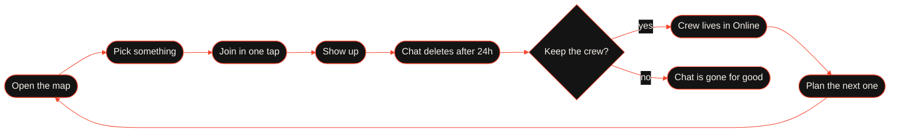
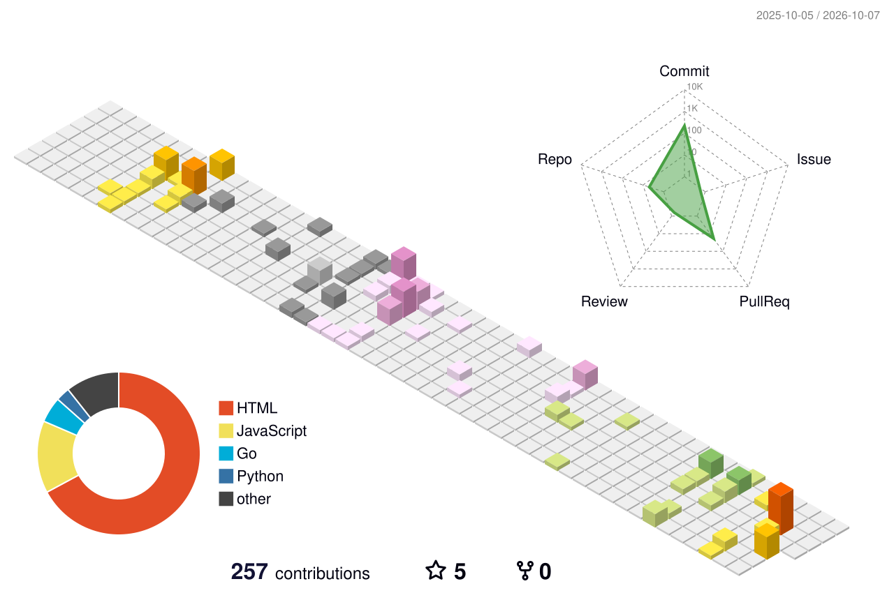

  

  

  
  
  

 

<table align="center">
  <tr>
    <td width="64%" valign="top">
      

        I'm a <b>Level IV Honours Computer Science Co-op</b> student at <b>McMaster University</b>, working where
        <b>AI</b>, <b>robotics</b>, and <b>software engineering</b> meet.
      

      

        🤖 <b>Now:</b> AI &amp; Robotics co-op at <b>Adaptron Inc.</b> in Ottawa.
          
        📄 <b>Research:</b> an applied AI tool built with a McMaster professor, with a <b>first-author manuscript</b> forthcoming.
          
        🔬 ML researcher at McMaster's <b>ICE Lab</b>, on explainable AI.
          
        🚀 <b>Side quest:</b> <a href="https://rallynow.ca"><b>Rally</b></a>, a free app that turns shared interests into real meetups, built with a team of four.
      

    </td>
    <td width="36%" align="center" valign="middle">
      
    </td>
  </tr>
</table>

<h3 align="center">🏆 Highlights</h3>

| | |
|---|---|
| 🥇 **Polytechnique Montréal** | Selected for the **2026 Undergraduate Summer Internship Award** out of **326 applicants from 36 universities**, for research in **AI in cybersecurity** under a professor |
| 📄 **Applied AI Research** | Web-based AI tool built with a McMaster professor, with a **first-author manuscript** forthcoming |
| 🤖 **Adaptron Inc.** | 8-month AI &amp; Robotics co-op in Ottawa, May to December 2026 |
| 📜 **McMaster Honours** | Award of Excellence (Fall 2022), Dean's Honour List (Winter 2023) |

<h3 align="center">🛠️ Tech Stack</h3>

<table align="center">
  <tr>
    <td align="right"><b>Languages</b></td>
    <td></td>
  </tr>
  <tr>
    <td align="right"><b>Web and Frameworks</b></td>
    <td></td>
  </tr>
  <tr>
    <td align="right"><b>AI and Data</b></td>
    <td></td>
  </tr>
  <tr>
    <td align="right"><b>Cloud and DevOps</b></td>
    <td></td>
  </tr>
  <tr>
    <td align="right"><b>Editors and Writing</b></td>
    <td></td>
  </tr>
</table>

<h3 align="center">🧪 What I'm Building</h3>

  

  
  
  

  <b>Rally</b> puts the pickup games, study sessions, and jam nights around you on one map. Meet people in person, then keep the crew together online. I'm building it with a team of four university students.

<table align="center" width="100%">
  <tr>
    <td valign="top" width="33%">
      <h4>🗺️ The loop</h4>
      <ul>
        <li>Opens on a map of everything near you, with the best fits highlighted</li>
        <li>One tap joins an event and opens its chat, with an icebreaker from what you share</li>
        <li>Event chats delete themselves 24 hours after the event, so there are no dead group chats</li>
      </ul>
    </td>
    <td valign="top" width="33%">
      <h4>💬 Online</h4>
      <ul>
        <li>Starts with <b>Gaming</b>: pick a game and find a group that plays when you do</li>
        <li>Crews you keep from real meetups live here, with a chat that stays</li>
        <li>Everyone decides for themselves whether to keep the crew</li>
      </ul>
    </td>

  </tr>
</table>

  MVP stack: Next.js and Supabase (Postgres with pgvector)

<h3 align="center">Relevant CS Coursework</h3>

<table align="center" width="100%">
  <tr>
    <td valign="top" width="50%">
      <table width="100%">
        <tr><th colspan="2" align="left">💻 Computer Science</th></tr>
        <tr><td>Algorithms and Software Design</td><td align="right"><b>A+</b></td></tr>
        <tr><td>Syntax-Based Tools and Compilers</td><td align="right"><b>A+</b></td></tr>
        <tr><td>Development Basics</td><td align="right"><b>A+</b></td></tr>
        <tr><td>Introduction to Programming</td><td align="right"><b>A</b></td></tr>
        <tr><td>Discrete Math for Computer Science</td><td align="right"><b>A</b></td></tr>
        <tr><td>Computer Architecture</td><td align="right"><b>A-</b></td></tr>
        <tr><td>Principles of Programming Languages</td><td align="right"><b>A-</b></td></tr>
        <tr><td>Operating Systems</td><td align="right"><b>A-</b></td></tr>
        <tr><td>Applied Cryptography</td><td align="right"><b>A-</b></td></tr>
        <tr><td>Data-Driven Algorithms</td><td align="right"><b>A-</b></td></tr>
        <tr><td>Software Testing</td><td align="right"><b>A-</b></td></tr>
        <tr><td>Intro to Software Using Web Programming</td><td align="right"><b>A-</b></td></tr>
        <tr><td>Intro to Computational Thinking</td><td align="right"><b>B+</b></td></tr>
        <tr><td>Computer Networks and Security</td><td align="right"><b>B+</b></td></tr>
      </table>
    </td>
    <td valign="top" width="50%">
      <table width="100%">
        <tr><th colspan="2" align="left">📐 Math and Stats</th></tr>
        <tr><td>Engineering Mathematics I</td><td align="right"><b>A</b></td></tr>
        <tr><td>Introduction to Probability</td><td align="right"><b>A</b></td></tr>
        <tr><td>Linear Algebra 1</td><td align="right"><b>A-</b></td></tr>
        <tr><td>Engineering Mathematics II-A</td><td align="right"><b>A-</b></td></tr>
      </table>
       
      <table width="100%">
        <tr><th colspan="2" align="left">🌐 Electives</th></tr>
        <tr><td>Introductory Macroeconomics</td><td align="right"><b>A+</b></td></tr>
        <tr><td>The Written World</td><td align="right"><b>A+</b></td></tr>
        <tr><td>Intro to Music Therapy Practice</td><td align="right"><b>A+</b></td></tr>
        <tr><td>Intro to Sustainability</td><td align="right"><b>A</b></td></tr>
        <tr><td>Introductory Microeconomics</td><td align="right"><b>A-</b></td></tr>
      </table>
    </td>
  </tr>
</table>

<h3 align="center">🕹️ My Contributions, Arcade Edition</h3>

  <picture>
    <source media="(prefers-color-scheme: dark)" srcset="https://raw.githubusercontent.com/alexgaffen/alexgaffen/output/pacman-contribution-graph-dark.svg" />
    <source media="(prefers-color-scheme: light)" srcset="https://raw.githubusercontent.com/alexgaffen/alexgaffen/output/pacman-contribution-graph.svg" />
    
  </picture>

<h3 align="center">🏙️ ...and in 3D</h3>

  <picture>
    <source media="(prefers-color-scheme: dark)" srcset="./profile-3d-contrib/profile-night-rainbow.svg" />
    <source media="(prefers-color-scheme: light)" srcset="./profile-3d-contrib/profile-season-animate.svg" />
    
  </picture>

  
  

  🎻 McMaster Symphony Orchestra violinist &nbsp;·&nbsp; ⚽ Soccer and pickleball &nbsp;·&nbsp; 🏃 Training for a first half marathon

  
  &nbsp;
  

